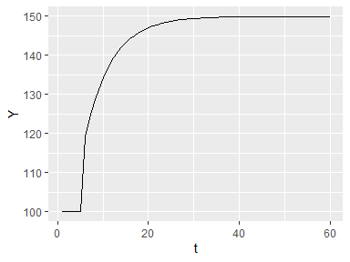

<!-- README.md is generated from README.Rmd. Please edit that file -->

# sfcr

<!-- badges: start -->

<!-- badges: end -->

The goal of `sfcr` is to provide an intuitive and `tidy` way to estimate
stock-flow consistent (SFC) models with R.

With `sfcr`, the models are written entirely with R using the standard R
syntax. Furthermore, their output is a `tibble` that is easily
manipulated with the `tidyverse` tools and plotted with `ggplot2`.

## Installation

You can install the development version from
[GitHub](https://github.com/) with:

``` r
# install.packages("devtools")
devtools::install_github("joaomacalos/sfcr")
```

## Example

This is a basic example which shows you how to simulate the steady state
of the “SIM” model from Godley and Lavoie (2007 ch. 3) and shock this
model with an increase in government expenditures.

The first step is to simulate the steady state of the model with the
`sfcr_sim()` function:

``` r
library(sfcr)
library(ggplot2)

eqs <- list(
  TX_s[t] ~ TX_d[t],
  YD[t] ~ W[t] * N_s[t] - TX_s[t],
  C_d[t] ~ alpha1 * YD[t] + alpha2 * H_h[t-1],
  H_h[t] ~ YD[t] - C_d[t] + H_h[t-1],
  N_s[t] ~ N_d[t],
  N_d[t] ~ Y[t] / W[t],
  C_s[t] ~ C_d[t],
  G_s[t] ~ G_d[t],
  Y[t] ~ C_s[t] + G_s[t],
  TX_d[t] ~ theta * W[t] * N_s[t],
  H_s[t] ~ G_d[t] - TX_d[t] + H_s[t-1]
)

exg <- list("G_d" = 20, "W" = 1)

params <- list("alpha1" = 0.6, "alpha2" = 0.4, "theta" = 0.2)

sim_model <- sfcr_sim(
  equations = eqs, 
  t = 60, 
  exogenous = exg, 
  parameters = params
  )

sim_model
#> # A tibble: 60 x 17
#>        t  TX_s    YD   C_d   H_h   N_s   N_d   C_s   G_s     Y  TX_d   H_s   G_d
#>    <int> <dbl> <dbl> <dbl> <dbl> <dbl> <dbl> <dbl> <dbl> <dbl> <dbl> <dbl> <dbl>
#>  1     1  1      1     1     1     1     1     1       1   1    1      1       1
#>  2     2  7.85  31.4  19.2  13.2  39.2  39.2  19.2    20  39.2  7.85  13.2    20
#>  3     3  9.72  38.9  28.6  23.4  48.6  48.6  28.6    20  48.6  9.72  23.4    20
#>  4     4 11.3   45.2  36.5  32.1  56.5  56.5  36.5    20  56.5 11.3   32.1    20
#>  5     5 12.6   50.5  43.2  39.5  63.2  63.2  43.2    20  63.2 12.6   39.5    20
#>  6     6 13.8   55.1  48.8  45.7  68.8  68.8  48.8    20  68.8 13.8   45.7    20
#>  7     7 14.7   58.9  53.6  51.0  73.6  73.6  53.6    20  73.6 14.7   51.0    20
#>  8     8 15.5   62.1  57.7  55.5  77.7  77.7  57.7    20  77.7 15.5   55.5    20
#>  9     9 16.2   64.9  61.1  59.2  81.1  81.1  61.1    20  81.1 16.2   59.3    20
#> 10    10 16.8   67.2  64.0  62.4  84.0  84.0  64.0    20  84.0 16.8   62.4    20
#> # ... with 50 more rows, and 4 more variables: W <dbl>, alpha1 <dbl>,
#> #   alpha2 <dbl>, theta <dbl>
```

With the steady state values at hand, we can use the `sfcr_scenario()`
function to see what happens if we increase government expenditures
(“G\_d”) from 20 to 30:

``` r
shock <- list("G_d" = 30)

sim2 <- sfcr_scenario(
  steady_state = sim_model,
  equations = eqs, 
  t = 60, 
  exogenous = exg, 
  parameters = params, 
  shock_exg = shock
  )

sim2
#> # A tibble: 60 x 17
#>        t  TX_s    YD   C_d   H_h   N_s   N_d   C_s   G_s     Y  TX_d   H_s   G_d
#>    <int> <dbl> <dbl> <dbl> <dbl> <dbl> <dbl> <dbl> <dbl> <dbl> <dbl> <dbl> <dbl>
#>  1     1  20.0  80.0  80.0  80.0  100.  100.  80.0    20  100.  20.0  80.2    20
#>  2     2  20.0  80.0  80.0  80.0  100.  100.  80.0    20  100.  20.0  80.2    20
#>  3     3  20.0  80.0  80.0  80.0  100.  100.  80.0    20  100.  20.0  80.2    20
#>  4     4  20.0  80.0  80.0  80.0  100.  100.  80.0    20  100.  20.0  80.2    20
#>  5     5  20.0  80.0  80.0  80.0  100.  100.  80.0    20  100.  20.0  80.2    20
#>  6     6  23.8  95.4  89.2  86.1  119.  119.  89.2    30  119.  23.8  86.4    30
#>  7     7  24.8  99.2  94.0  91.4  124.  124.  94.0    30  124.  24.8  91.6    30
#>  8     8  25.6 102.   98.0  95.8  128.  128.  98.0    30  128.  25.6  96.0    30
#>  9     9  26.3 105.  101.   99.5  131.  131. 101.     30  131.  26.3  99.7    30
#> 10    10  26.8 107.  104.  103.   134.  134. 104.     30  134.  26.8 103.     30
#> # ... with 50 more rows, and 4 more variables: W <dbl>, alpha1 <dbl>,
#> #   alpha2 <dbl>, theta <dbl>
```

The output is conveniently stored as a `tibble`. It means that we can
easily plot this model using the `ggplot2` package:

``` r
sim2 %>%
  ggplot(aes(x = t, y = Y)) +
  geom_line() +
  labs(x = "Time", y = "Output")
```



See the vignettes for more developed examples.

### References

<div id="refs" class="references hanging-indent">

<div id="ref-godley2007monetary">

Godley, Wynne, and Marc Lavoie. 2007. *Monetary Economics: An Integrated
Approach to Credit, Money, Income, Production and Wealth*. Palgrave
Macmillan.

</div>

</div>
